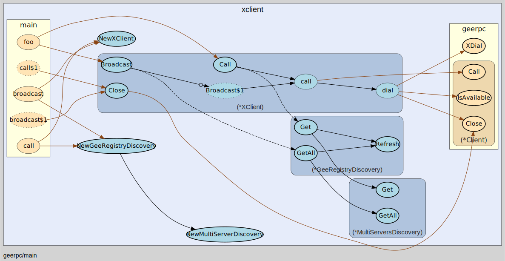

# go-rpc

go-rpc 是在阅读 [gee-rpc](https://github.com/geektutu/7days-golang/tree/master/gee-rpc) 源码时的一些注解。

一个典型的 rpc 框架由如下几部分构成，分别为 :
 - 消息编解码
 - 客户端
 - 服务端
 - 服务注册
 - 服务发现
 - 超时控制
 - 负载均衡

接下来通过图片的方式， 给出各个组件的模块和构成。

# 整体流程

整个项目的入口出为 `main/main.go`, 代码如下：

```go
func main() {
	log.SetFlags(0)
	registryAddr := "http://localhost:9999/_geerpc_/registry"
	var wg sync.WaitGroup
	wg.Add(1)
	//启动注册中心
	go startRegistry(&wg)
	wg.Wait()

	time.Sleep(time.Second)
	wg.Add(2)
	//启动服务,并注册
	go startServer(registryAddr, &wg)
	go startServer(registryAddr, &wg)
	wg.Wait()

	time.Sleep(time.Second)
	//客户端调用服务
	call(registryAddr)
	broadcast(registryAddr)
}
```

可以看到先后启动了 `注册中心`,`服务端`,最后`客户端`通过 `call()` 和 `broadcast()` 两个函数调用服务。

其中客户端的调用最终都转给 `xlient` 这个对象去执行, 服务端在启动时(`startServer`) 通过 `HeartBeat()` 向注册中心(`registry`) 上报心跳并注册。


# 客户端(XClient)
## 服务发现
客户端的请求是由 `XClient` 来控制的，通过集成服务发现(`GeeRedistryDiscover`)来获取一个可用的服务地址(rpcAddr)，然后将服务端地址交给 `dial()` 内部的 `Client` 对象来处理。



## Client
XClient 中的请求最终是通过 Client 对象来完成，Client 对象的实现了真正的请求发送(`send`)与接收(`receive`), 同时消息的编码协议交给了 `Codec` 对象来处理。


## 消息编解码(GobCodec)
GobCodec 用作编码协议, 客户端和服务端在请求与响应的过程中需要对消息进行双向编解码。


# 服务端(Server)
服务端通过 `startServer()` 来启动，先是通过 `NewServer` 实力化一个 `Server`，然后将 Server 内部的某些对象注册成服务(`Service`)，最后通过 `ServeConn` 处理来自客户端的请求。


# 服务注册
注册中心是一个独立的服务，在项目入口通过一个 goroutine 来启动：
```go
func main() {
	..
	//启动注册中心
	go startRegistry(&wg)
	...
}
```

同时我们看到服务启动时，通过 `Heartbeat` 来向注册中心注册自己。
```go
func startServer(registryAddr string, wg *sync.WaitGroup) {
	..
	//注册服务本身到注册中心
		//registryAddr:注册中心的地址
		//addr:当前服务地址
	registry.Heartbeat(registryAddr, "tcp@"+l.Addr().String(), 0)
	wg.Done()
	server.Accept(l)
}
```


